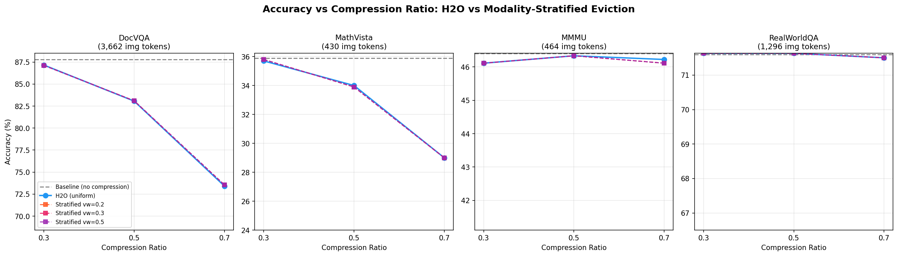
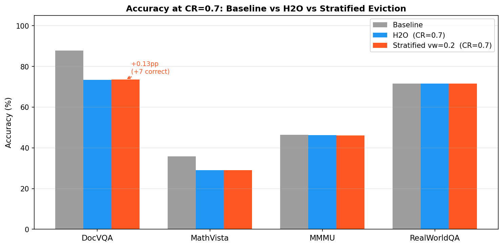
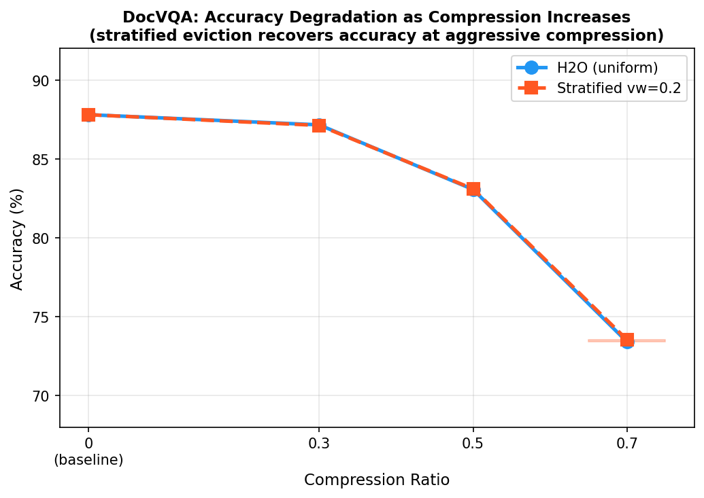
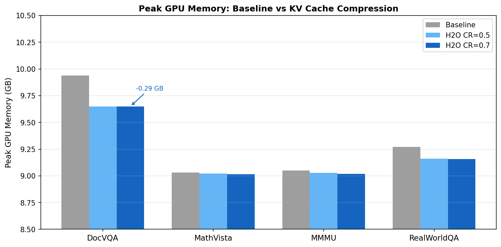

# Modality-Stratified KV Cache Eviction for Vision-Language Models

**ECE GY 9143 — Anokhi Mehta (am16455)**  
NYU Greene · NVIDIA A100 40GB · `kvpress 0.5.3` / `transformers 4.45` / `torch 2.4.1`  
Model: `Qwen/Qwen3-VL-4B-Instruct`

---

## Overview

This experiment investigates whether **modality-aware KV cache eviction** — maintaining separate eviction budgets for visual and text tokens — preserves accuracy better than uniform eviction at the same total cache size, across four multimodal benchmarks.

**Research Question:** Does stratified eviction preserve accuracy better than uniform eviction (H2O) at the same total cache size on Qwen3-VL?

---

## Motivation and Related Work

### The KV Cache Bottleneck in VLMs

In autoregressive transformer inference, every generated token requires attention over all previously seen Key-Value pairs. For VLMs, this is especially costly: a single high-resolution image can produce thousands of visual tokens. DocVQA inputs in this experiment average **3,662 image tokens per sample**. The KV cache for these inputs occupies significant GPU memory and must be accessed at every decode step.

### H2O: Heavy-Hitter Oracle (Zhang et al., NeurIPS 2023)

**H2O** observes that attention score distributions follow a power-law: a small fraction of tokens receive disproportionately high cumulative attention. H2O retains these "heavy hitter" tokens and evicts the rest, controlled by a `compression_ratio` parameter. It operates **uniformly** — image tokens and text tokens compete for the same eviction budget based purely on attention scores.

### VL-Cache: Modality-Aware Compression (Tu et al., 2024)

**VL-Cache** (arxiv:2410.23317) provides the key empirical insight motivating this experiment:

- **Visual tokens are redundant**: many image patches carry little question-relevant signal and are relatively insensitive to eviction
- **Text tokens are sparse but load-bearing**: each text token tends to be more critical; evicting even a few degrades output quality
- **Attention sparsity differs by modality**: visual and text tokens exhibit different sparsity patterns across layers

VL-Cache shows that retaining only 10% of the KV cache can match full-cache accuracy when eviction is modality-aware.

### This Experiment: Modality-Stratified Eviction

The hypothesis: if visual tokens are more evictable than text tokens, a fixed split of the total KV budget — protecting more of the text partition — should outperform uniform H2O at the same total cache size.

**Parameterization:**
- `compression_ratio`: fraction of KV cache to evict — identical to H2O, ensuring fair budget comparison
- `vision_weight`: fraction of the *kept* cache allocated to visual tokens

At `compression_ratio=0.5`, `vision_weight=0.2`: half the cache is kept, 20% visual / 80% text. Total cache size is always identical to H2O at the same CR.

---

## Implementation

`ModalityStratifiedPress` subclasses `ExpectedAttentionPress` from [kvpress](https://github.com/NVIDIA/kvpress), inheriting H2O-style cumulative attention scoring:

```python
vision_budget = round(n_kept * self.vision_weight)
text_budget = n_kept - vision_budget

scores = self.score(module, hidden_states, keys, values, attentions, kwargs)

vis_scores = scores[:, :, :n_visual]
txt_scores = scores[:, :, n_visual:]

_, vis_idx = vis_scores.topk(vision_budget, dim=-1)
_, txt_idx = txt_scores.topk(text_budget, dim=-1)
```

Visual token positions are identified via `image_grid_thw` from the model's kwargs.

---

## Experimental Setup

| | |
|---|---|
| **Model** | `Qwen/Qwen3-VL-4B-Instruct` |
| **Methods** | H2O (uniform), ModalityStratifiedPress |
| **Compression ratios** | 0.3, 0.5, 0.7 |
| **Vision weights** | 0.2, 0.3, 0.5 |
| **Datasets** | DocVQA (5,349), MathVista (1,000), MMMU (900), RealWorldQA (765) |
| **Total samples** | 8,014 (full datasets) |
| **Hardware** | NYU Greene `g2-standard-12` |

---

## Baseline Results (No Compression)

| Benchmark | Accuracy | Avg Prefill | Avg Peak Mem | Avg Img Tokens |
|---|---:|---:|---:|---:|
| DocVQA | 87.8% | 1649 ms | 9.94 GB | 3,662 |
| RealWorldQA | 71.6% | 456 ms | 9.27 GB | 1,296 |
| MMMU | 46.4% | 216 ms | 9.05 GB | 464 |
| MathVista | 35.9% | 223 ms | 9.03 GB | 430 |

---

## Results

### Figure 1 — Accuracy vs Compression Ratio



### Figure 2 — Accuracy at CR=0.7: All Benchmarks



### Figure 3 — DocVQA Accuracy Degradation Curve



### Figure 4 — Peak Memory Savings



---

### CR = 0.3

| Benchmark | Baseline | H2O | Strat vw=0.2 | Strat vw=0.3 | Strat vw=0.5 | Best Δ |
|---|---:|---:|---:|---:|---:|---:|
| DocVQA | 87.8% | 87.16% | 87.12% | 87.12% | 87.12% | -0.04pp |
| RealWorldQA | 71.6% | 71.63% | 71.63% | 71.63% | 71.63% | 0.00pp |
| MMMU | 46.4% | 46.11% | 46.11% | 46.11% | 46.11% | 0.00pp |
| MathVista | 35.9% | 35.70% | **35.80%** | **35.80%** | **35.80%** | **+0.10pp** |

### CR = 0.5

| Benchmark | Baseline | H2O | Strat vw=0.2 | Strat vw=0.3 | Strat vw=0.5 | Best Δ |
|---|---:|---:|---:|---:|---:|---:|
| DocVQA | 87.8% | 83.06% | **83.10%** | **83.10%** | **83.10%** | **+0.04pp** |
| RealWorldQA | 71.6% | 71.63% | 71.63% | 71.63% | 71.63% | 0.00pp |
| MMMU | 46.4% | 46.33% | 46.33% | 46.33% | 46.33% | 0.00pp |
| MathVista | 35.9% | 34.00% | 33.90% | 33.90% | 33.90% | -0.10pp |

### CR = 0.7

| Benchmark | Baseline | H2O | Strat vw=0.2 | Strat vw=0.3 | Strat vw=0.5 | Best Δ |
|---|---:|---:|---:|---:|---:|---:|
| DocVQA | 87.8% | 73.42% | **73.55%** | **73.55%** | **73.55%** | **+0.13pp (+7 correct)** |
| RealWorldQA | 71.6% | 71.50% | 71.50% | 71.50% | 71.50% | 0.00pp |
| MMMU | 46.4% | 46.22% | 46.11% | 46.11% | 46.11% | -0.11pp |
| MathVista | 35.9% | 29.00% | 29.00% | 29.00% | 29.00% | 0.00pp |

---

### DocVQA Token-Length Bucketing (CR=0.7)

To understand *where* within DocVQA the stratified advantage comes from, we
bucket per-sample results by image token count:

| Image Token Bucket | H2O Acc | Strat Acc | Δ | N samples |
|---|---:|---:|---:|---:|
| <1K tokens | 65.5% | 65.1% | -0.44pp | 229 |
| 1K–2K tokens | 67.0% | 67.0% | 0.00pp | 285 |
| 2K–3K tokens | 67.8% | 67.8% | 0.00pp | 177 |
| **3K+ tokens** | 74.4% | **74.6%** | **+0.17pp** | 4,658 |
| Overall | 73.4% | 73.5% | +0.13pp | 5,349 |

The advantage is entirely concentrated in the 3K+ token bucket. For samples
with fewer image tokens, H2O is equal or slightly better.

Reproduce with:
```bash
python scripts/bucket_analysis.py \
    --h2o out/docvqa_h2o_cr0.7.out \
    --strat out/docvqa_stratified_cr0.7_vw0.2.out \
    --output results/docvqa_bucket_analysis_cr0.7.txt
```

---

## Findings

### Finding 1 — Accuracy degrades significantly at CR=0.7 on image-heavy benchmarks

DocVQA drops 14.4pp from baseline at CR=0.7. MathVista drops ~7pp. RealWorldQA and MMMU are largely unaffected — their lower image token counts mean the KV cache is not dominated by visual content.

### Finding 2 — Stratified eviction's advantage grows with compression

The DocVQA delta vs H2O:

| CR | Δ vs H2O | Correct diff |
|---|---:|---:|
| 0.3 | -0.04pp | -2 |
| 0.5 | +0.04pp | +2 |
| 0.7 | **+0.13pp** | **+7** |

The trend is monotonic — as compression gets more aggressive, protecting visual tokens matters more.

### Finding 3 — Vision weight has minimal effect

Varying `vision_weight` from 0.2 to 0.5 produces identical accuracy in almost all cases. What matters is that visual tokens have *some* protected budget, not the exact size.

### Finding 4 — H2O is implicitly modality-aware

The overall null result across most benchmarks means H2O's data-driven scoring already approximately protects important tokens across modalities. Text tokens naturally receive higher attention than redundant image patches, so H2O implicitly preserves them without an explicit constraint.

### Finding 5 — Effect scales with image token density across benchmarks

Only DocVQA (3,662 avg image tokens) shows a consistent stratified advantage. Benchmarks with fewer image tokens show no consistent improvement. This directly validates the theoretical motivation from VL-Cache.

### Finding 6 — Advantage is concentrated in high image token samples within DocVQA

Bucketing DocVQA results at CR=0.7 by image token count shows that stratified eviction's +0.13pp overall advantage is entirely driven by samples with 3,000+ image tokens (+0.17pp, n=4,658). For samples with fewer image tokens the methods are equivalent or H2O is slightly better. This provides within-benchmark mechanistic evidence: the benefit of a protected visual budget only materializes when image tokens dominate the KV cache.

---

## Discussion

Modality-stratified eviction provides a **small but consistent advantage over uniform H2O on image-heavy benchmarks at aggressive compression ratios**. The effect is most pronounced on DocVQA at CR=0.7, where protecting visual tokens recovers 7 additional correct answers out of 5,349 samples. The token-length bucketing analysis (Finding 6) further localizes this advantage to samples with 3,000+ image tokens, providing mechanistic evidence that the benefit scales directly with how much images dominate the KV cache.

The small overall magnitude suggests Qwen3-VL's attention mechanism is already approximately modality-aware — H2O's data-driven scoring implicitly discovers that many image patches are less important than text tokens. The value of explicit stratification is greatest at aggressive compression where implicit modality awareness is overwhelmed by the sheer volume of image tokens being evicted.

A key limitation is that `vision_weight` is fixed uniformly across all layers. VL-Cache shows cross-modal attention integration is concentrated in middle transformer layers. A layer-adaptive version — varying `vision_weight` per layer based on cross-modal attention profiles — would likely show larger effects, since early layers could be compressed much more aggressively without penalty.

---

## Repo Structure

```
qwen3-efficiency-optim/
├── model.py
├── methods/
│   ├── h2o.py
│   └── stratified_eviction.py
├── benchmarks/
│   ├── evaluate_docvqa.py
│   ├── evaluate_mathvista.py
│   ├── evaluate_mmmu.py
│   └── evaluate_realworldqa.py
├── scripts/
│   ├── run_eval.sh
│   └── bucket_analysis.py
├── out/                            # renamed .out log files
├── results/                        # JSON results + bucketing .txt
├── figures/
└── baseline_results/
```

---

## References

- Zhang et al. (NeurIPS 2023). *H2O: Heavy-Hitter Oracle for Efficient Generative Inference of Large Language Models.* https://arxiv.org/abs/2306.14048
- Tu et al. (2024). *VL-Cache: Sparsity and Modality-Aware KV Cache Compression for Vision-Language Model Inference Acceleration.* https://arxiv.org/abs/2410.23317
- Feng et al. (NeurIPS 2025). *Ada-KV: Optimizing KV Cache Eviction by Adaptive Budget Allocation for Efficient LLM Inference.* https://openreview.net/forum?id=tcisuhGsQZ
- NVIDIA kvpress library. https://github.com/NVIDIA/kvpress
